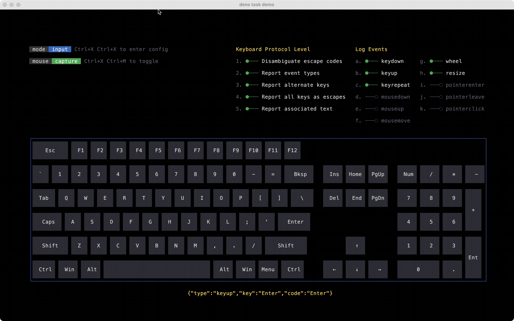
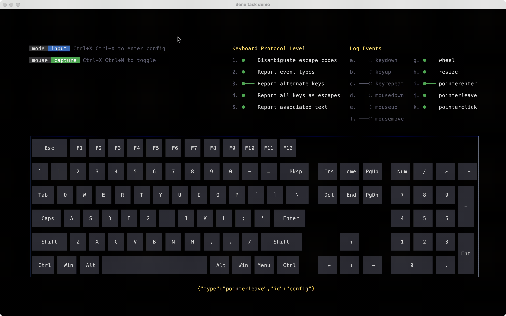

# examples

This directory contains runnable example applications that exercise different
features of libs. If any of these examples are not working, please open an issue
with information about your terminal, shell, operating system and any other
information that could be pertinent to reproducing the issue.

> [!NOTE]
> Run the commands in this document from the repository root. These examples use
> `node:` terminal APIs so the same files can be run with either Deno or Node.

## Prerequisites

Build the generated WebAssembly bundle before running the examples:

```sh
make
```

## Keyboard

Path: `examples/keyboard/index.ts`

Run it with:

```sh
deno run examples/keyboard/index.ts
# or
node examples/keyboard/index.ts
```

What it shows:

- raw keyboard input decoded into structured key events
- progressive keyboard protocol support
- pointer tracking and hover/click-driven UI updates
- terminal mode configuration such as alternate buffer, hidden cursor, and mouse
  reporting

Related files:

- `examples/keyboard/use-input.ts` wraps the input parser as a stream of decoded
  events
- `examples/keyboard/use-stdin.ts` adapts stdin into a byte stream for the demo

#### Keyboard Events

The input parser decodes raw terminal bytes into structured events. Here you can
see each key event as the string "hello world" is typed.



#### Pointer Events

Here we see hover styles applied to UI elements in response to the pointer
state. Clay drives the hit testing; no manual coordinate math required.



## Inline Regions

Path: `examples/inline-regions/index.ts`

Run it with:

```sh
deno run examples/inline-regions/index.ts
# or
node examples/inline-regions/index.ts
```

What it shows:

- rendering animated regions into normal terminal scrollback
- querying cursor position with Device Status Report (DSR) to place later frames
  correctly
- updating a previously allocated region without taking over the whole screen
- small animated demos including a spinner, a progress bar, and a nyan-cat-style
  sequence

This example is useful if you want to embed transient or animated UI output into
a normal command-line workflow instead of switching to a full-screen alternate
buffer interface.
