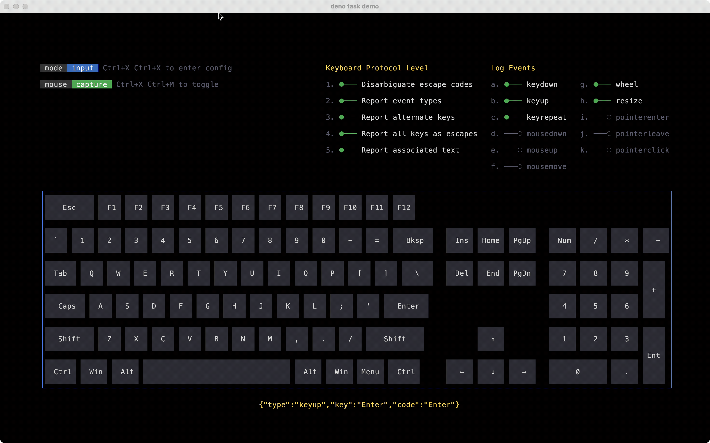
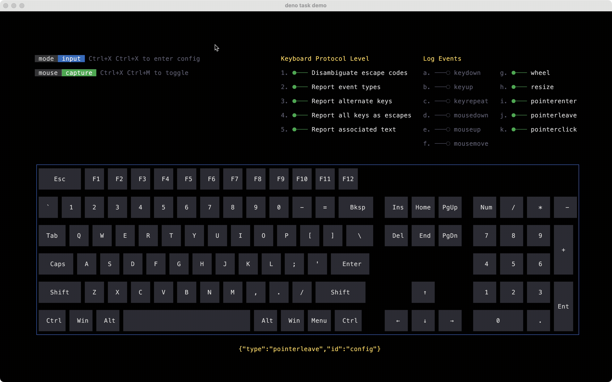

# examples

This directory contains runnable example applications that exercise different
features of libs. If any of these examples are not working, please open an issue
with information about your terminal, shell, operating system and any other
information that could be pertinent to reproducing the issue.

> [!NOTE]
> Run the commands in this document from the repository root. These examples use
> `node:` terminal APIs so the same files can be run with either Deno or Node.

## Prerequisites

Build the generated WebAssembly bundle before running the examples:

```sh
make
```

## Keyboard

Path: `examples/keyboard/index.ts`

Run it with:

```sh
deno run examples/keyboard/index.ts
# or
node examples/keyboard/index.ts
```

What it shows:

- raw keyboard input decoded into structured key events
- progressive keyboard protocol support
- pointer tracking and hover/click-driven UI updates
- terminal mode configuration such as alternate buffer, hidden cursor, and mouse
  reporting

Related files:

- `examples/keyboard/use-input.ts` wraps the input parser as a stream of decoded
  events
- `examples/keyboard/use-stdin.ts` adapts stdin into a byte stream for the demo

#### Keyboard Events

The input parser decodes raw terminal bytes into structured events. Here you can
see each key event as the string "hello world" is typed.



#### Pointer Events

Here we see hover styles applied to UI elements in response to the pointer
state. Clay drives the hit testing; no manual coordinate math required.



## Transitions

Paths: `examples/transitions/sidebar.ts` and `examples/transitions/notecards.ts`

Run them with:

```sh
deno run examples/transitions/sidebar.ts
# or
deno run examples/transitions/notecards.ts
```

What they show:

- element transitions driven by changing layout and style properties
- renderer `animating` state for scheduling follow-up frames
- color and layout interpolation in an interactive keyboard/sidebar demo

## 2048

Path: `examples/2048/index.ts`

Run it with:

```sh
deno run examples/2048/index.ts
# or
node examples/2048/index.ts
```

Controls: arrows or `wasd` to move, `Tab`/`Shift+Tab` to move focus,
`Enter`/`Space` to activate the focused button, `n` new game, `u` undo, `q` or
`Ctrl+C` to quit. The board size selector and game-over panel are clickable too.

What it shows:

- a motion-first game where the board tiles slide and recolor using the v1
  `transition` field (`position`, `bg`), keyed on stable tile ids so the layout
  engine interpolates each tile between frames
- the `animating` render signal gating a follow-up frame loop, so the process
  only renders while something is moving
- pointer hit testing and keyboard focus working together on the chrome buttons
- an fps readout in the footer: a sliding-window count of frames pushed to
  stdout in the last second. It measures how fast frames are _produced_, not how
  fast the terminal _paints_ them — a CPU-rendered terminal (e.g. Terminal.app)
  can coalesce or drop frames downstream where the process can't observe it, so
  motion can look steppy even while this number stays high
- live resize handling: a `SIGWINCH` listener is bridged into the Effection
  event loop, and because the native term has fixed-size buffers, each real size
  change rebuilds the term, clears the screen, and repaints so the layout
  re-centers to the new dimensions
- a keycaster overlay: recent key presses and button clicks appear as a centered
  row of caps near the bottom (a floating, pointer-passthrough element) that
  retire on a timer, handy for screen recordings and demos

Known v1 limitations (deferred upstream, see `specs/transitions-spec.md` §13):

- There are no enter/exit transitions, so newly spawned tiles simply appear in
  place and merged-away tiles are dropped immediately rather than sliding out.
- Tiles animate `position` and `bg` but not `size`. The v1 renderer snaps cells
  to the integer grid, so a sub-cell size/scale "pop" renders as a misaligned
  short block instead of a smooth scale. Smooth sub-cell motion is exactly what
  the upcoming raster rendering path is for; until then tiles stay aligned to
  whole cells and only slide and recolor.

## Inline Regions

Path: `examples/inline-regions/index.ts`

Run it with:

```sh
deno run examples/inline-regions/index.ts
# or
node examples/inline-regions/index.ts
```

What it shows:

- rendering animated regions into normal terminal scrollback
- querying cursor position with Device Status Report (DSR) to place later frames
  correctly
- updating a previously allocated region without taking over the whole screen
- small animated demos including a spinner, a progress bar, and a nyan-cat-style
  sequence

This example is useful if you want to embed transient or animated UI output into
a normal command-line workflow instead of switching to a full-screen alternate
buffer interface.
